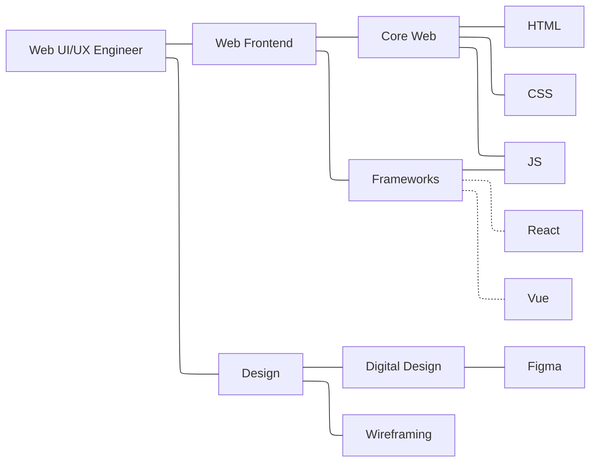
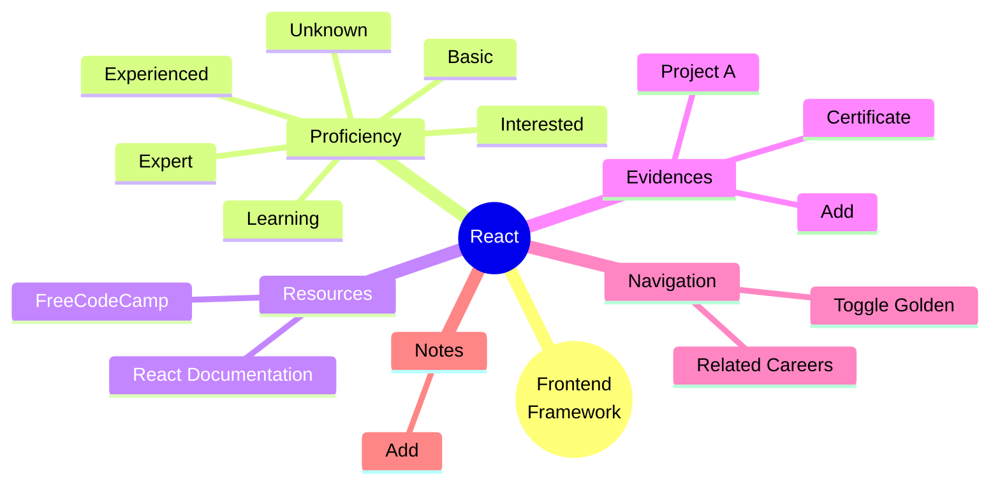

---
{"dg-publish":true,"permalink":"/Projects/Brain Vomit/Washer/Student job thingy/"}
---

## !!{centered}Student Career Support!!
Students frequently face uncertainty when preparing for future careers. From building resumes and searching for internships to understanding market demands and networking effectively, many students lack clear direction and actionable feedback. This topic encourages teams to design systems that support career preparation and improve students’ readiness for professional opportunities.
**Goal:** Help students prepare for future career opportunities and understand how their current skills match market demands.

| Suggested Ideas                                                                                   | Suggested Datasets                                                                                |
| ------------------------------------------------------------------------------------------------- | ------------------------------------------------------------------------------------------------- |
| Resume-job matching<br>==Skill gap analysis==<br>CV feedback tool<br>==Career roadmap assistant== | Resume Dataset (Kaggle)<br>Job Description Dataset (Kaggle)<br>O*NET: https://www.onetcenter.org/ |

---
#### B side
- Concept
	- Tinder-esque career discovery, vibe-based swiping matches users with dream jobs, then visualise personalised learning path in a constellation
- Onboarding
	- Select skills from curated list
	- Take note of rare skills/skill combinations, disregard more common ones
- Discovery
	- From chosen rare skills, present cards with "day in the life" scenarios instead of chores
	- Swipe right = +1 point to tagged skill, swipe left = -1
	- When a job title accumulated 5 points, it's a match, trigger constellation view
- Constellation map
	- From job title, generate skills downward: job → domains → modules → skills
	- Child nodes start out gray. Marking parent as interested unlocks interactions
	- Choose proficiency for child to mark as learned skill (unknown, interested, learning, basic, experienced, expert)
	- Some skills unlock other skills, instead of just parent(s)
	- Share map to people (screenshot? link?)
- Golden path
	- User mark branches as golden to designate specialised niches
	- Non golden paths act as side quests
- Constellation discovery
	- Related fields naturally stay closer
	- Some bridge nodes reveals faint lines to more job titles
- Payoff
	- Job title switches from interested to ready when golden path, or threshold of nodes, is learned
	- ? Generate bullet points based on unlocked skills
	- Export visual image of constellation for bragging points
- Constrains
	- TRUST THE USER, DO NOT VERIFY
	- Do not make use of machine learning yet (not enough time, too volatile)
	- Hand craft several perfect skill tree for demo
	- Eye candy animations
- Off the table ideas
	- Theme toggle: minimal neon, space galaxy, organic coral
	- Jiggle physics when checked

---
#### Washing machine 
- Tinder but for jobs
	- Hinder (❄️)
- Degree of separation
	- 20 words about oneself, discard 10 most popular ones, then find connections
	- ⇒ Onboarding
	- Filter by either dataset, or in house tracker
- Swipe
	- For each job titles that's related to what the user probably likes
	- Make several questions
		- Spend 3 hours tweaking the style of a button until it 'looks right' (css, digital design)
		- Dig through 6 layers of nested components to refactor (js, react, optimisation)
		- Present a project to non tech savvy, grumpy old men (communication, agile)
		- Set up a folder structure so clean it makes other devs cry tears of joy (architecture)
	- Swipe right = "Wow, I enjoy doing this" +1 point for skills
	- Swipe left = "Nah, hard pass" -1
	- Add the score of each skills to each job title
	- When score = 5 ⇒ it's a match! (go you)
	- ⇒ Discovery view
- Skill constellation 
	- After matching job title
	- Add the job title to the middle of the map (infinite map)
	- Then gradually fade in skills required that list up to that job


-
    - Other titles will be in the same network graph, creating a link
    - Solid line = required to go up graph
    - Dotted line = required to do down graph
    - Near the top: bigger nodes
    - When clicked a node: name, description, dropdown
	    - Unknown, interested, learning, basic, experienced, expert
	- Need to unlock at least one (learning or basic) to unlock higher node
	- 4 layers currently. Need dataset to know exactly how many layers
- Job title in skill constellation
	- When matched: highlight and "Matched! 0% ready"
	- Dropdown: unknown, interested, ready (locked)
	- Interested → "great, let's start unlocking skills"
	- When some (?) categories are learned: allow clicking ready
	- Ready → "Congratulations, you are ready to become a blah blah blah"
	- Generate bullet points for resume?
- Onboarding
	- No longer discard words, but use the popular words as categories
	- Generic skills: "You and 90% other users know python and C++. That won't get you noticed."
	- Rare skills: "Only 0.2% of the users know python and 3d modelling. That's your superpower!"
	- Choose from a list instead of random words for easier filtering?
- First few swipe
	- [React tinder card](https://github.com/Br0mmie/react-tinder-card)
	- Questions can be for all layers. Higher up = more points
	- From the rare skills
	- Ask closer to job title first
	- Questions = vibe, not chore
	- Maybe pre add some skills in the graph
- Constellation
	- [React force graph](https://github.com/3DJakob/react-tinder-card) (omg 3d graph)
	- Generate from top down
	- The childs are gray, and not interactable yet
	- When choose interested, the childs will now be able to be selected
	- Allow to mark some nodes/path as golden (as in, specialised)
	- Some faint lines over some nodes for discovey
		- JS: gateway to frontend, backend, software engineer
	- Send map to people
	- Some resources for learning (some locked behind skill levels?)
- Generate questions
	- Pre-made questions
	- Some templating
	- Light weight, free AI? Temp self hosted?

```js
const webElements = "(button|card|checkbox|toggle)";
const template = `Spend (2|3|4) hours tweaking a ${webElements} until it 'looks right'.`;

const regex = /\(([^)]+)\)/g;
function gen(template) {
  return template.replace(regex, (_, group) => {
    const options = group.split("|");
    return options[Math.floor(Math.random() * options.length)];
  });
}

console.log(gen(template));
```
- 
    - Maybe match the flavor text of left/right to each card?
    - Or generic, but changed after each swipe to that direction?
    - Maybe pull from both?

```json
{
  "template": "Dig through (4|5|6) layers of nested (code|props) to find one missing (bracket|parenthesis).",
  "tags": ["Debugging", "JS"],
  "right_action": "(I love a puzzle!|The thrill of the hunt.)", 
  "left_action": "(Headache incoming!|I have dyslexia!)"
}
```

- Random
	- Swipe on phone, plan on desktop?
		- Use scrcpy to copy phone over for presentation
		- Need real time updating
		- Backend required???
	- Add self declared proofs to nodes (github, certs, ...)
		- Add to graph somehow?
	- When click each node: add some nodes for options instead of open a card
		- Too small on mobile?


- 
    - (per obsidian) Reduced motion, 2d/3d mode, time lapse. customisable forces, filter: interested only, show options, ...
    - Color codes
	    - Different node types: different shapes
	    - Proficiency: colors inside the nodes
	    - Golden path: outline, path
	    - Evidences: 2nd ring
	    - It sparkles and shimmers, it shines and delights
	- It's a match: instead of modal, make the next card the job title
		- Swipe right: to constellation
		- Swipe left: reject, and doesn't add to constellation
		- Swipe up: continue swiping?
		- The accepted card keeps flying right, goes to the constellation, and adds itself as a node
		- Swipe up on normal cards for "what is this"???
		- Need react spring or framer motion