---
{"dg-publish":true,"permalink":"/Studies/University/Year 1/T2/EM1180 - Business Culture and Entrepreneurship/Project/Summary - slides/"}
---

> [!warning] Chú ý
> - Giữa mỗi 2 gạch dài là khoảng một slide
> - Phần "comment" là phần đọc, không cho vào slide
> - Ở thanh bên phải của trang web, có thể thấy rõ ràng chia phần hơn (mở trên máy tính)
> - Các tiêu đề to: mở đầu của phần
> - Các tiêu đề nhỏ: phía trên của slide

---

## Trình bày về Đạo đức Kinh doanh và Trách nhiệm Xã hội của Doanh nghiệp Google

*Môn học: Văn hoá kinh doanh và tinh thần khởi nghiệp - EM1180*

---
### Nhóm 5

> [!columns blank|3]
> 
> > [!blank]
> > <h6>Thành viên</h6>
> > Cù Thị Như Quỳnh
> > Phạm Mai Anh
> > Nguyễn Thị Khánh Vân
> > Nguyễn Phi Hoàng
> > Vũ Phúc Hưng
>
> > [!blank]
> > <h6>MSSV</h6>
> > 20230498 
> > 20230324 
> > 20230544 
> > 202416209
> > 202416512
> 
> > [!blank]
> > <h6>Nhiệm vụ</h6>

---

# Lời Mở đầu

---

> [!blank]
> 
> > [!caption|p+r] 
> > /warren-buffett-biography-586590455f9b586e02609252.jpg)
> 
> > [!quote] Warren Buffett
> > Đạo đức kinh doanh không phải là một sự lựa chọn, mà là nền tảng cho mọi quyết định.

---

> [!comment|c-gray]
> Qua nhiều thập kỷ, sự phát triển của xã hội và kinh tế, đặc biệt trong bối cảnh công nghệ và toàn cầu hóa, đã tạo ra nhiều dấu ấn quan trọng.
> Các doanh nghiệp tăng trưởng cùng với sự đóng góp mạnh mẽ vào nhiều lĩnh vực khác nhau trong đời sống xã hội, như
> - Tạo ra cơ hội việc làm
> - Nâng cao chất lượng cuộc sống
> - Đào tạo nguồn lực tiềm năng
> - Đóng góp cho ngân sách quốc gia
> - Thúc đẩy thay đổi cơ cấu thị trường
> - ...

### Tác động của Doanh nghiệp trong Kỷ nguyên Toàn cầu hóa

> [!cards|2]
> 
> > [!caption]
> > 
> > Thúc đẩy tăng trưởng kinh tế, công nghệ
> 
> > [!caption]
> > 
> > Tạo việc làm, nâng chất lượng cuộc sống.
> 
> > [!caption]
> > 
> > Đào tạo nhân lực trẻ, đóng góp vào ngân sách.
> 
> > [!caption]
> > 
> > Thúc đẩy đổi mới, thay đổi cơ cấu thị trường.

---

> [!comment|c-gray] 
> Nhưng song song đó, sự cạnh tranh đã làm xuất hiện mặt tiêu cực bất chấp yếu tố đạo đức. Nhiều doanh nghiệp sai phạm trong sản xuất, bóc lột người lao động, đưa thông tin sai lệch nhằm đạt mục đích trục lợi đã gây ra những hậu quả nghiêm trọng cho cả doanh nghiệp lẫn cộng đồng.

### Mức Ảnh hưởng của Đạo đức Kinh doanh

**Cạnh tranh Khốc liệt Dẫn đến Hành vi Kinh doanh Phi đạo đức**
> [!cards|3] 
> > [!caption]
> > 
> > Bóc lột lao động
>
> > [!caption]
> > 
> > Sai phạm trong sản xuất
>
> > [!caption]
> > 
> > Thao túng thông tin

**⇒ Gây Tổn hại cho Doanh nghiệp & Cộng đồng**

---

> [!comment|c-gray]
> Vì vậy để phát triển bền vững, đạo đức kinh doanh là yếu tố quan trọng giúp doanh nghiệp được tin tưởng, tín nhiệm của người dùng và người lao động, đảm bảo uy tín và duy trì lợi thế cạnh tranh lâu dài. ĐĐKD là chìa khóa để doanh nghiệp tồn tại và phát triển thành công bền vững.

### Đạo đức Kinh doanh - Cách Phát triển Bền vững

**Đạo đức Kinh doanh giúp Doanh nghiệp:**

> [!cards|3] 
> > [!caption]
> > 
> > Xây dựng niềm tin & uy tín.
>
> > [!caption]
> > 
> > Duy trì lợi thế cạnh tranh dài hạn.
>
> > [!caption]
> > 
> > Phát triển bền vững & thành công.

---

> [!comment|c-gray]
> Sau quá trình học tập từ bài giảng, chúng em nhận thức được tầm quan trọng của ĐĐKD đối với doanh nghiệp. Nhóm em đã tìm hiểu, nghiên cứu về đề tài này, và thông qua đó đã có hiểu biết để nhìn nhận về những nguyên tắc và khía cạnh ĐĐKD mà doanh nghiệp Google đang áp dụng trong thực tiễn.
> 
> Trong quá trình làm có thể còn nhiều thiếu sót, nhóm chúng em rất mong sẽ nhận được những đánh giá từ cô để bài báo cáo được hoàn thiện hơn.
> 
> Chúng em xin chân thành cảm ơn!

> [!columns blank]
>
> > [!caption]
> > 
>
> > [!caption]
> > 

---

# Cơ sở Lý thuyết về Văn hóa Kinh doanh

---

> [!comment|c-gray]
> Văn hóa là tổng hòa những giá trị vật chất và tinh thần, cũng như các phương thức tạo ra chúng, kỹ năng sử dụng các giá trị đó vì sự tiến bộ của loài người, và sự truyền thụ các giá trị đó từ thế hệ này sang thế hệ khác.

## Văn hoá theo Triết học Mác - Lênin

**Văn hoá:**

> [!columns blank|3]
> 
> > [!caption]
> > 
> > Giá trị vật chất & tinh thần
> 
> > [!caption]
> > 
> > Phương thức sáng tạo & sử dụng vì sự tiến bộ
> 
> > [!caption]
> > 
> > Truyền từ thế hệ này sang thế hệ khác

---

> [!comment|c-gray]
> VD: Tín ngưỡng thờ cúng Hùng Vương là nét văn hóa đặc sắc của Việt Nam, thể hiện lòng biết ơn tổ tiên và tinh thần dân tộc. Hằng năm, người dân hành hương về Đền Hùng dâng hương tưởng nhớ các Vua Hùng. Nó còn phản ánh ý thức nguồn cội, lòng tự hào dân tộc, và đạo lý "Uống nước nhớ nguồn".

## Khái niệm Văn hoá theo Triết học Mác - Lênin

**Ví dụ:** Tín ngưỡng thờ cúng Hùng Vương

> [!columns blank|3]
> 
> > [!caption]
> > 
> > Tượng Vua Hùng
> 
> > [!caption]
> > 
> > Đền Hùng Phú Thọ
> 
> > [!caption]
> > 
> > Hành hương ở Đền Hùng

---

> [!comment|c-gray]
> Văn hóa doanh nhân là hệ thống các giá trị, chuẩn mực, quan niệm, và hành vi của doanh nhân trong quá trình lãnh đạo và quản lý doanh nghiệp.

## Văn hoá Doanh nhân

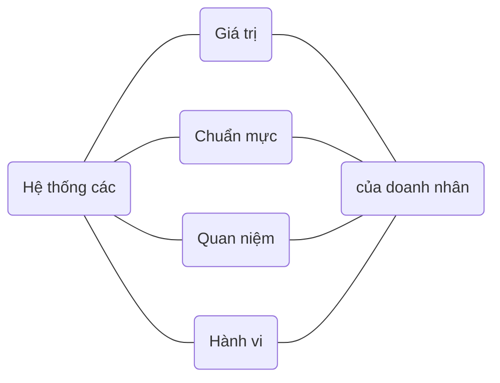
```mermaid
flowchart LR
  A(Hệ thống các)
  B(Giá trị)
  C(Chuẩn mực)
  D(Quan niệm)
  E(Hành vi)
  F(của doanh nhân)

  A --- B & C & D & E --- F
```

---
> [!comment|c-gray]
> Lãnh đạo không chỉ là điều hành, mà còn là khả năng truyền cảm hứng, định hướng, và xây dựng môi trường làm việc tích cực. Một doanh nhân có văn hóa lãnh đạo tốt sẽ đề cao tính minh bạch, trách nhiệm, sáng tạo và tinh thần hợp tác. Họ không chỉ ra quyết định, mà còn biết lắng nghe, tạo động lực cho nhân viên, và dẫn dắt tổ chức phát triển theo hướng bền vững.

## Văn hoá Doanh nhân trong Lãnh đạo

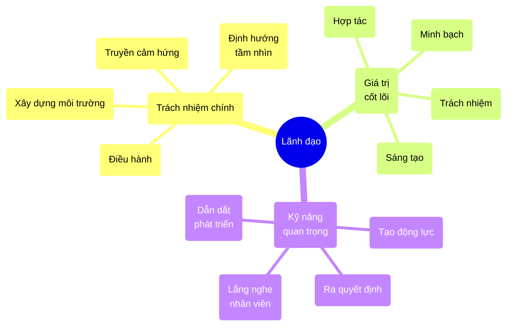
```mermaid
mindmap
  root((Lãnh đạo))
    (Trách nhiệm chính)
      (Điều hành)
      (Truyền cảm hứng)
      (Định hướng<br/>tầm nhìn)
      (Xây dựng môi trường)
    (Giá trị<br/>cốt lõi)
      (Minh bạch)
      (Trách nhiệm)
      (Sáng tạo)
      (Hợp tác)
    (Kỹ năng<br/>quan trọng)
      (Ra quyết định)
      (Lắng nghe<br/>nhân viên)
      (Tạo động lực)
      (Dẫn dắt<br/>phát triển)
```

---

> [!comment|c-gray]
> Trong quản lý, VHDN thể hiện qua cách doanh nhân tổ chức, vận hành doanh nghiệp và giải quyết các vấn đề nội bộ. Một doanh nhân có văn hóa quản lý chuyên nghiệp sẽ chú trọng đến việc xây dựng quy trình làm việc hiệu quả, phân công công việc hợp lý, tạo môi trường làm việc công bằng và thúc đẩy sự phát triển cá nhân của nhân viên.

## Văn hoá Doanh nhân trong Quản lý

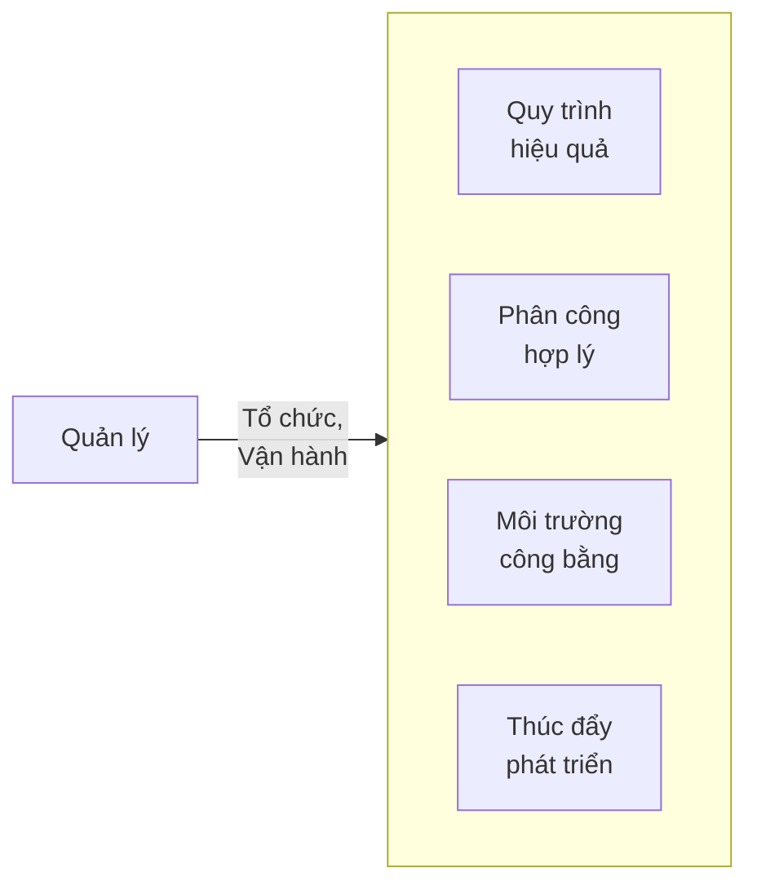
```mermaid
graph LR
    A[Quản lý]
    subgraph B[" "]
        direction LR
        B1[Quy trình<br/>hiệu quả]
        B2[Phân công<br/>hợp lý]
        B3[Môi trường<br/>công bằng]
        B4[Thúc đẩy<br/>phát triển]
    end
    A -->|Tổ chức,<br/>Vận hành| B
```

---

> [!comment|c-gray]
> VD: Phạm Nhật Vượng là một nhà lãnh đạo có tầm nhìn dài hạn và tinh thần tiên phong. Ông không ngừng đổi mới, thúc đẩy sự sáng tạo, và đưa thương hiệu Việt vươn tầm thế giới. Dưới sự dẫn dắt của ông, Vingroup đã mở rộng sang nhiều lĩnh vực, với VinFast trở thành biểu tượng của công nghiệp hóa. Ông đề cao trách nhiệm xã hội, tạo động lực cho nhân viên và hướng doanh nghiệp phát triển bền vững.

## Văn hoá Doanh nhân

**Ví dụ:**

> [!columns blank|3]
> 
> > [!caption]
> > 
> > Phạm Nhật Vượng
> 
> > [!caption]
> > 
> > Xe điện Vinfast VF7
> 
> > [!caption]
> > 
> > Vingroup trao học bổng

---

> [!comment|c-gray]
> VHDNghiệp hay VH tổ chức là hệ thống giá trị, chuẩn mực và hành vi được hình thành, tích lũy qua quá trình tương tác và hội nhập. Nó được chia sẻ rộng rãi, định hướng tư duy và cách ứng xử của các thành viên trong doanh nghiệp.

## Văn hoá Doanh nghiệp

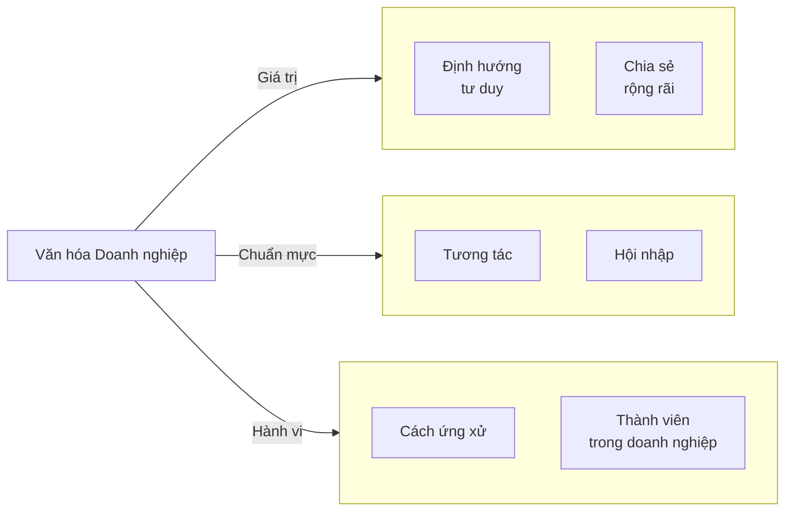
```mermaid
graph LR
    A[Văn hóa Doanh nghiệp] -->|Giá trị|B
    A -->|Chuẩn mực|C
    A -->|Hành vi|D

    subgraph B[" "]
        B1[Định hướng<br/>tư duy]
        B2[Chia sẻ<br/>rộng rãi]
    end

    subgraph C[" "]
        C1[Tương tác]
        C2[Hội nhập]
    end

    subgraph D[" "]
        D1[Cách ứng xử]
        D2[Thành viên<br/>trong doanh nghiệp]
    end
```

---

> [!comment|c-gray]
> VD: VHDN của Google tập trung vào sự sáng tạo, linh hoạt, và môi trường làm việc thân thiện. Công ty khuyến khích nhân viên dành 20% thời gian cho các dự án cá nhân, tạo điều kiện cho ý tưởng mới ra đời. Google đề cao sự thẳng thắn, tinh thần khởi nghiệp, và làm việc nhóm, đồng thời cung cấp môi trường thoải mái với nhiều tiện ích. Những giá trị này giúp Google duy trì sự đổi mới và thu hút nhân tài toàn cầu.

## Văn hoá Doanh nghiệp

> [!columns blank|3]
> 
> > [!captions]
> > 
> > Nhân viên tại Google
> 
> > [!captions]
> > 
> > Nhân viên nghỉ ngơi
> 
> > [!captions]
> > 
> > "20% thời gian"

**=> Giúp Google duy trì sự đổi mới và thu hút nhân tài toàn cầu**

---

> [!comment|c-gray]
> - Các giá trị VHDN là hệ thống có quan hệ chặt chẽ, được chấp nhận, và phổ biến rộng rãi giữa các thành viên
> - Hệ thống các giá trị văn hoá phải là kết quả của quá trình lựa chọn hoặc sáng tạo của chính các thành viên
> - Các giá trị VHDN phải có một sức mạnh đủ để tác động đến nhận thức, tư duy và cảm nhận của các thành viên đối với các vấn đề và quan hệ của doanh nghiệp

## Văn hoá Doanh nghiệp

**Hiểu Thế nào cho Đúng về Văn hoá Doanh nghiệp**

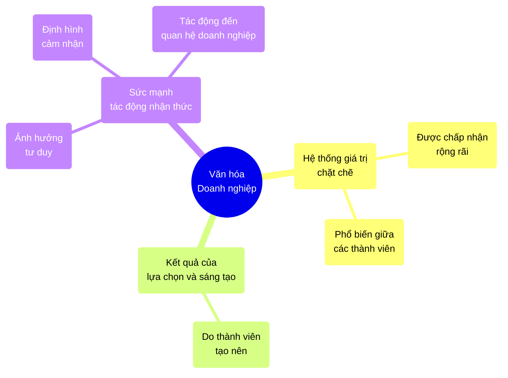
```mermaid
mindmap
  root((Văn hóa<br/>Doanh nghiệp))
    (Hệ thống giá trị<br/>chặt chẽ)
      (Được chấp nhận<br/>rộng rãi)
      (Phổ biến giữa<br/>các thành viên)
    (Kết quả của<br/>lựa chọn và sáng tạo)
      (Do thành viên<br/>tạo nên)
    (Sức mạnh<br/>tác động nhận thức)
      (Ảnh hưởng<br/>tư duy)
      (Định hình<br/>cảm nhận)
      (Tác động đến<br/>quan hệ doanh nghiệp)
```

---

> [!comment|c-gray]
> - Những gì một người từ bên ngoài DN có thể nhìn thấy, nghe thấy, hoặc cảm nhận được khi tiếp xúc với DN - các yếu tố hữu hình.
> - Những giá trị được chấp nhận, bao gồm những chiến lược, những mục tiêu và triết lý kinh doanh của DN.
> - Khi các giá trị được thừa nhận và phổ biến đến mức gần như không có sự thay đổi, chúng sẽ trở thành các giá trị nền tảng.

## Văn hoá Doanh nghiệp

**Cấu trúc của Hệ thống Văn hoá Kinh doanh**

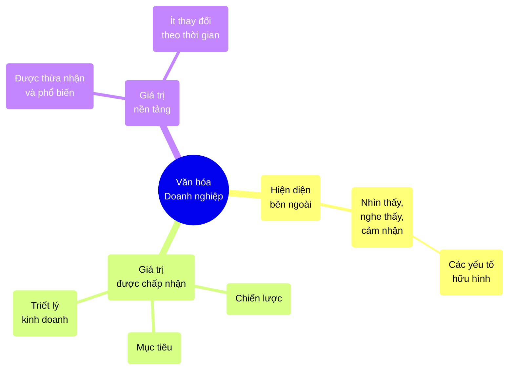
```mermaid
mindmap
  root((Văn hóa<br/>Doanh nghiệp))
    (Hiện diện<br/>bên ngoài)
      (Nhìn thấy,<br/>nghe thấy,<br/>cảm nhận)
	      (Các yếu tố<br/>hữu hình)
    (Giá trị<br/>được chấp nhận)
      (Chiến lược)
      (Mục tiêu)
      (Triết lý<br/>kinh doanh)
    (Giá trị<br/>nền tảng)
      (Được thừa nhận<br/>và phổ biến)
      (Ít thay đổi<br/>theo thời gian)
```

---

> [!comment|c-gray]
> Văn hóa kinh doanh là hệ thống các giá trị, chuẩn mực, và hành vi do doanh nghiệp tạo ra trong quá trình hoạt động. Nó thể hiện qua cách ứng xử với xã hội, môi trường, và cộng đồng, góp phần định hình bản sắc và uy tín trong kinh doanh.

## Văn hoá Kinh doanh

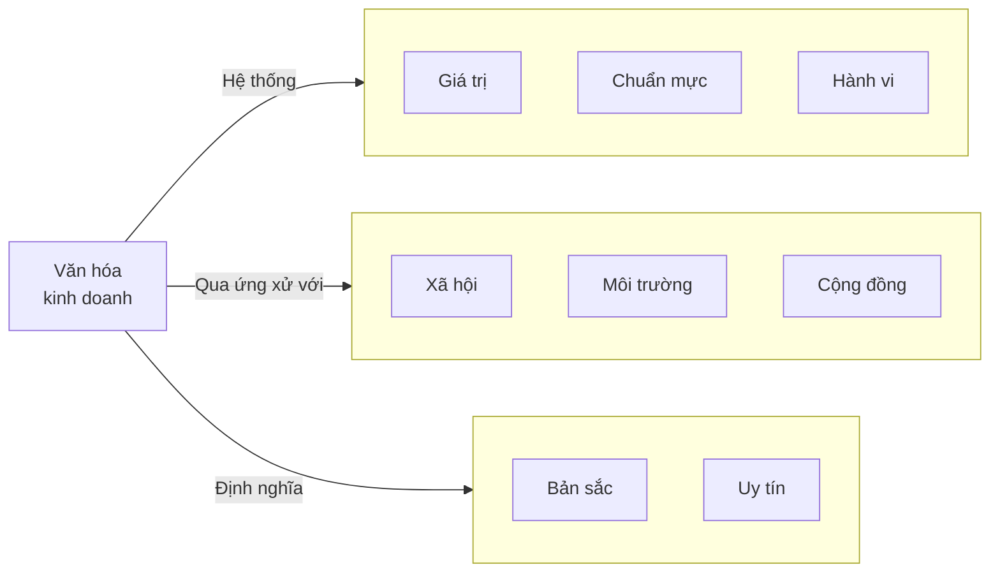
```mermaid
graph LR
    A[Văn hóa<br/>kinh doanh] -->|Hệ thống|B
    A -->|Qua ứng xử với|C
    A -->|Định nghĩa|D
    subgraph B[" "]
	    B1[Giá trị]
	    B2[Chuẩn mực]
	    B3[Hành vi]
    end
    subgraph C[" "]
	    C1[Xã hội]
	    C2[Môi trường]
	    C3[Cộng đồng]
    end
    subgraph D[" "]
	    D1[Bản sắc]
	    D2[Uy tín]
    end
```

---

> [!comment|c-gray]
> VD: Toyota dùng triết lý "Just-in-Time", tối ưu hóa sản xuất, giảm lãng phí, và nâng cao hiệu suất. Nhờ đó, hãng không chỉ tạo dựng niềm tin mà còn góp phần xây dựng môi trường kinh doanh bền vững và phát triển lâu dài.

## Văn hoá Kinh doanh

> [!columns blank|2]
> 
> > [!caption]
> > 
> > Toyota
> 
> > [!caption]
> > 
> > Bộ phận

---

> [!comment|c-gray]
> VHDNhân, DNghiệp, và KD có mối quan hệ chặt chẽ, tác động qua lại lẫn nhau. VHDNhân là cốt lõi, vì DNhân định hướng giá trị, phong cách lãnh đạo, và cách vận hành doanh nghiệp. Từ đó, VHDNghiệp hình thành, phản ánh các chuẩn mực ứng xử và quy tắc làm việc trong tổ chức.
> VHDNghiệp phải phù hợp với VHKD - bao gồm các quy chuẩn đạo đức, luật pháp, và tập quán chung của ngành nghề. Một DNghiệp có văn hóa tốt sẽ góp phần nâng cao môi trường kinh doanh, và sự suy thoái có thể gây hệ lụy tiêu cực. Vì vậy, để phát triển bền vững, DNghiệp cần hài hòa cả ba yếu tố này, với DNhân đóng vai trò then chốt.

## Mối Quan hệ giữa Văn hoá Doanh nhân, Văn hoá Doanh nghiệp, và Văn hoá Kinh doanh

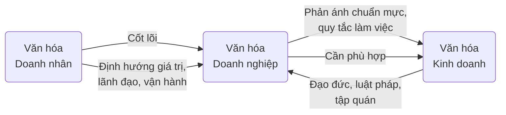
```mermaid
graph LR
    A(Văn hóa<br/>Doanh nhân)
    B(Văn hóa<br/>Doanh nghiệp)
    C(Văn hóa<br/>Kinh doanh)

    A -->|Cốt lõi| B
    A -->|Định hướng giá trị,<br/>lãnh đạo, vận hành| B
    B -->|Phản ánh chuẩn mực,<br/>quy tắc làm việc| C
    B -->|Cần phù hợp| C
    C -->|Đạo đức, luật pháp,<br/>tập quán| B
```

---

> [!comment|c-gray]
> - Văn hoá là cơ sở cho phát triển doanh nghiệp
> - Tài sản quan trọng nhất là nhân lực
> - Yếu tố văn hóa là một công cụ quan trọng để phát huy tiềm năng của nguồn lực này
> - Mỗi doanh nghiệp cần xây dựng văn hoá riêng

## Kết luận

- Văn hoá: cơ sở
- Tài sản quan trọng nhất: nhân lực
- Yếu tố văn hóa: quan trọng để phát huy tiềm năn
- Doanh nghiệp: cần văn hoá riêng

---

# Cơ sở Lý thuyết về Đạo đức Kinh doanh

---

> [!comment|c-gray]
> - Đạo đức là hệ thống nguyên tắc, quy tắc xã hội, nhằm điều chỉnh hành vi con người đối với bản thân và xã hội.
> - Chức năng chính là định hướng hành vi theo các chuẩn mực được xã hội thừa nhận, thông qua lương tâm, dư luận, tập quán và giáo dục.
> - Đồng thời, nó quy định trách nhiệm, nghĩa vụ mỗi cá nhân, là tiêu chuẩn xây dựng lối sống và lý tưởng. Các chuẩn mực đạo đức bao gồm những điều tích cực và tiêu cực.

## Khái niệm Đạo đức

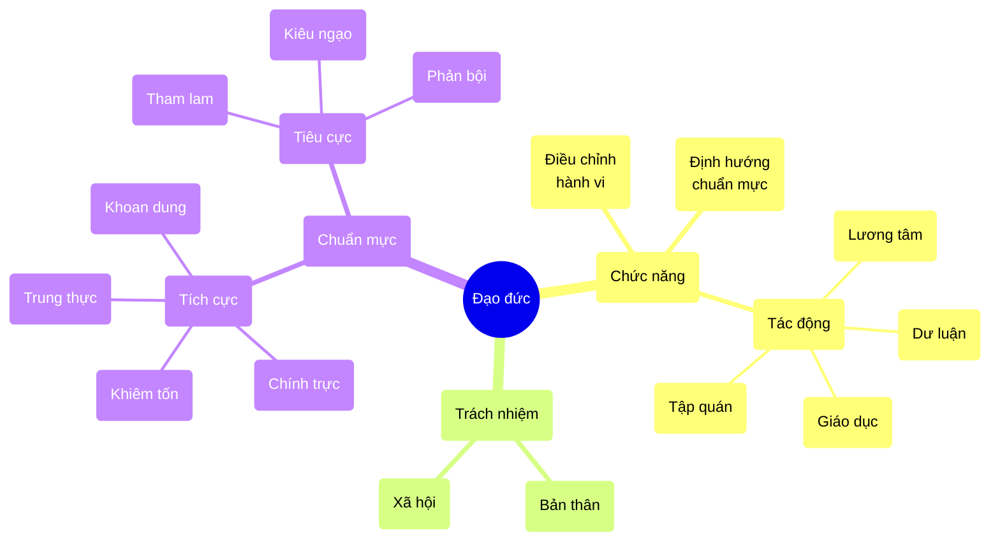
```mermaid
mindmap
  root((Đạo đức))
    (Chức năng)
      (Điều chỉnh<br/>hành vi)
      (Định hướng<br/>chuẩn mực)
      (Tác động)
	      (Lương tâm)
	      (Dư luận)
	      (Tập quán)
	      (Giáo dục)
    (Trách nhiệm)
      (Bản thân)
      (Xã hội)
    (Chuẩn mực)
      (Tích cực)
        (Chính trực)
        (Khiêm tốn)
        (Trung thực)
        (Khoan dung)
      (Tiêu cực)
        (Tham lam)
        (Kiêu ngạo)
        (Phản bội)
```

---

> [!comment|c-gray]
> - Thời cổ đại: Xuất hiện cùng hoạt động thương mại (~4000 TCN). Hình thành quy tắc về trung thực, chữ tín, sòng phẳng.
> - Thế kỷ 20:
>     - Trước 1960: Gắn với tôn giáo, công bằng lao động.
>     - 1960~1970: Gia tăng vấn đề môi trường, bảo vệ người dùng, xuất hiện nghiên cứu về trách nhiệm.
>     - Những năm 1980: Được công nhận là lĩnh vực nghiên cứu độc lập, xuất hiện các trung tâm nghiên cứu, giảng dạy.
>     - Những năm 1990: Chính phủ Mỹ thể chế hóa đạo, doanh nghiệp chịu trách nhiệm về hành vi phi đạo đức.
> - Thế kỉ 21: Gắn chặt với trách nhiệm xã hội và quyết định trong công ty, thành lĩnh vực nghiên cứu quan trọng.

## Lịch sử Đạo đức Kinh doanh

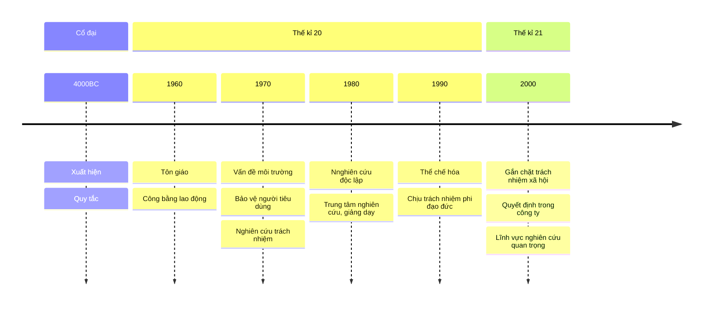
```mermaid
timeline
    section Cổ đại
	    4000BC : Xuất hiện
			   : Quy tắc
    section Thế kỉ 20
	    1960 : Tôn giáo
		     : Công bằng lao động
	    1970 : Vấn đề môi trường
		     : Bảo vệ người tiêu dùng
		     : Nghiên cứu trách nhiệm
	    1980 : Nnghiên cứu<br>độc lập
		     : Trung tâm nghiên cứu, giảng dạy
	    1990 : Thể chế hóa
		     : Chịu trách nhiệm phi đạo đức
	section Thế kỉ 21
	    2000 : Gắn chặt trách nhiệm xã hội
		     : Quyết định trong công ty
		     : Lĩnh vực nghiên cứu quan trọng
```

---

> [!comment|c-gray]
> Đạo đức kinh doanh:
> - Tập hợp nguyên tắc, chuẩn mực có tác dụng điều chỉnh, đánh giá, hướng dẫn, và kiểm soát hành vi các chủ thể kinh doanh.
> - Là đạo đức được vận dụng vào trong hoạt động kinh doanh.
> - Là một dạng đạo đức nghề nghiệp: có tính đặc thù của hoạt động kinh doanh - do kinh doanh là gắn liền lợi ích kinh tế.

## Khái niệm Đạo đức Kinh doanh

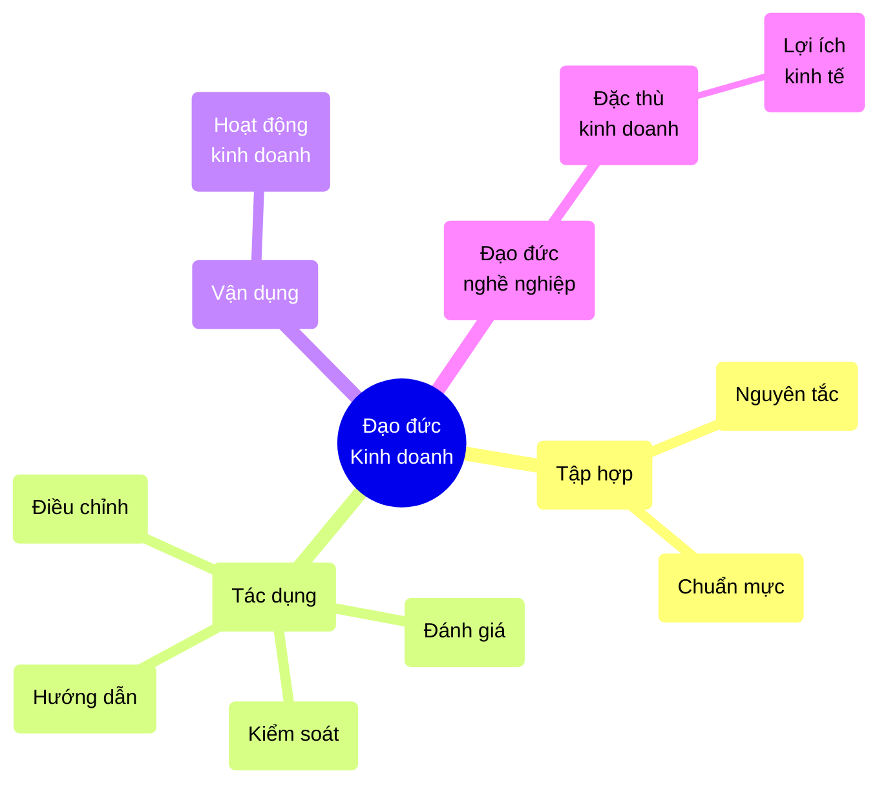
```mermaid
mindmap
root((Đạo đức<br/>Kinh doanh))
	(Tập hợp)
		(Nguyên tắc)
		(Chuẩn mực)
	(Tác dụng)
		(Điều chỉnh)
		(Đánh giá)
		(Hướng dẫn)
		(Kiểm soát)
	(Vận dụng)
		(Hoạt động<br/>kinh doanh)
	(Đạo đức<br/>nghề nghiệp)
		(Đặc thù<br/>kinh doanh)
			(Lợi ích<br/>kinh tế)
```

---

> [!comment|c-gray]
> - Điều chỉnh hành vi: Giúp doanh nghiệp trung thực, công bằng, tạo môi trường cạnh tranh lành mạnh, và hạn chế phi đạo đức.
> - Nâng cao chất lượng hoạt động: Giúp cải thiện hiệu suất, giảm tranh chấp, và nâng cao uy tín.
> - Tăng cam kết nhân viên: Giúp nhân viên tự hào, gắn bó và làm việc tận tâm hơn.
> - Nâng cao hài lòng khách hàng: Tạo lòng tin và quan hệ bền vững.
> - Tạo lợi nhuận bền vững: Xây dựng uy tín, giảm rủi ro pháp lý và duy trì lợi nhuận ổn định.
> - Nâng cao uy tín thương hiệu: Nâng cao hình ảnh ngành nghề và quốc gia, thu hút đầu tư và cơ hội kinh doanh.

## Vai trò của Đạo đức Kinh doanh

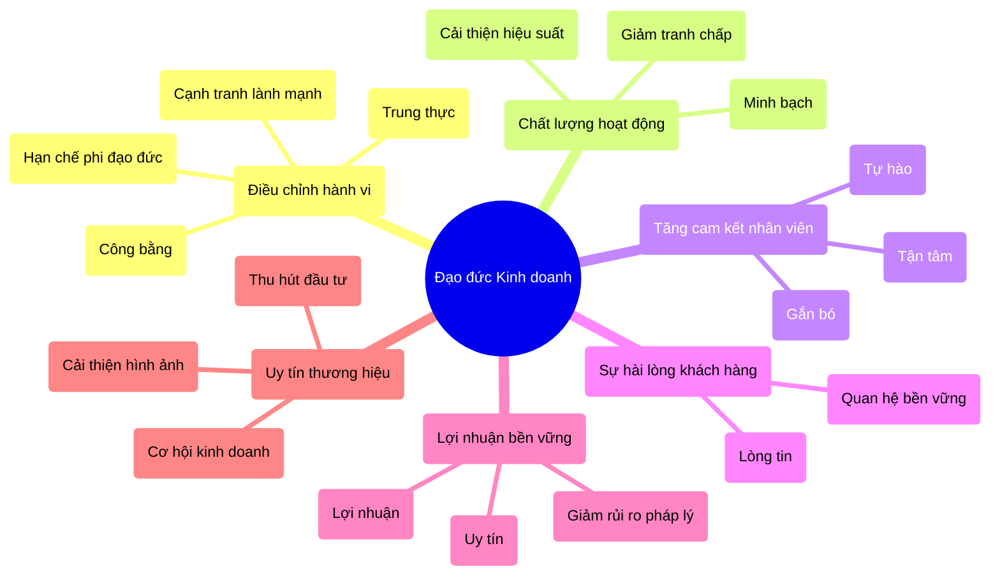
```mermaid
mindmap
  root((Đạo đức Kinh doanh))
    (Điều chỉnh hành vi)
      (Trung thực)
      (Công bằng)
      (Cạnh tranh lành mạnh)
      (Hạn chế phi đạo đức)
    (Chất lượng hoạt động)
      (Minh bạch)
      (Cải thiện hiệu suất)
      (Giảm tranh chấp)
    (Tăng cam kết nhân viên)
      (Tự hào)
      (Gắn bó)
      (Tận tâm)
    (Sự hài lòng khách hàng)
      (Lòng tin)
      (Quan hệ bền vững)
    (Lợi nhuận bền vững)
      (Uy tín)
      (Giảm rủi ro pháp lý)
      (Lợi nhuận)
    (Uy tín thương hiệu)
      (Cải thiện hình ảnh )
      (Thu hút đầu tư)
      (Cơ hội kinh doanh)
```

---

> [!comment|c-gray]
> - Trung thực: Không gian dối, giữ chữ tín, tuân thủ pháp luật, không làm hàng giả, quảng cáo sai sự thật, cạnh tranh không lành mạnh.
> - Tôn trọng con người: Tôn trọng nhân viên, khách hàng, và đối thủ cạnh tranh, đảm bảo quyền lợi chính đáng và môi trường làm việc công bằng.
> - Gắn lợi ích với xã hội: Không chỉ theo đuổi lợi nhuận mà còn quan tâm đến tác động của hoạt động kinh doanh đối với cộng đồng và môi trường.
> - Bảo mật, trung thành: Giữ bí mật thông tin khách hàng, đối tác và tuân thủ cam kết đạo đức để duy trì uy tín doanh nghiệp.

## Nguyên tắc và Chuẩn mực Đạo đức Kinh doanh

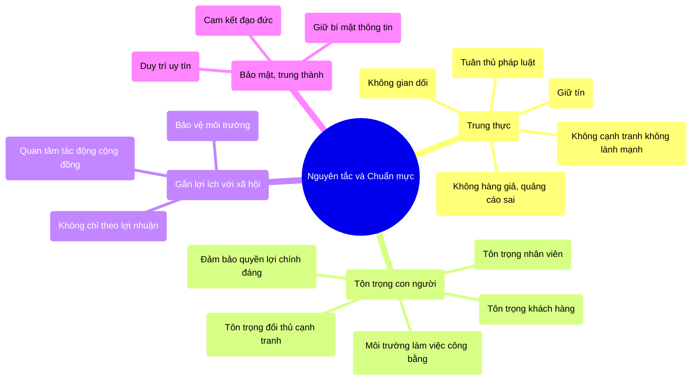
```mermaid
mindmap
  root((Nguyên tắc và Chuẩn mực))
    (Trung thực)
      (Không gian dối)
      (Giữ tín)
      (Tuân thủ pháp luật)
      (Không hàng giả, quảng cáo sai)
      (Không cạnh tranh không lành mạnh)
    (Tôn trọng con người)
      (Tôn trọng nhân viên)
      (Tôn trọng khách hàng)
      (Tôn trọng đối thủ cạnh tranh)
      (Đảm bảo quyền lợi chính đáng)
      (Môi trường làm việc công bằng)
    (Gắn lợi ích với xã hội)
      (Không chỉ theo lợi nhuận)
      (Quan tâm tác động cộng đồng)
      (Bảo vệ môi trường)
    (Bảo mật, trung thành)
      (Giữ bí mật thông tin)
      (Cam kết đạo đức)
      (Duy trì uy tín)
```

---

> [!comment|c-gray]
> - Xây văn hóa đạo đức: Cần thiết lập quy tắc, chính sách đạo đức rõ ràng, thúc đẩy môi trường làm việc minh bạch và công bằng. Tổ chức tập huấn, truyền thông nội bộ để nhân viên thấu hiểu và tuân thủ các giá trị chung.
> - Đào tạo nhân viên: Trang bị kiến thức, hướng dẫn cách xử lý tình huống, nâng cao nhận thức, và khả năng ra quyết định. Khuyến khích trao đổi, chia sẻ kinh nghiệm để hình thành tư duy trong công việc.
> - Thiết lập chính sách: Ban hành quy định cụ thể về hành vi đúng và sai, đảm bảo minh bạch trong xử lý vi phạm. Xây dựng cơ chế giám sát, phản hồi và chế tài để duy trì việc tuân thủ trong mọi hoạt động kinh doanh.

## Cách Áp dụng Đạo đức trong Kinh doanh

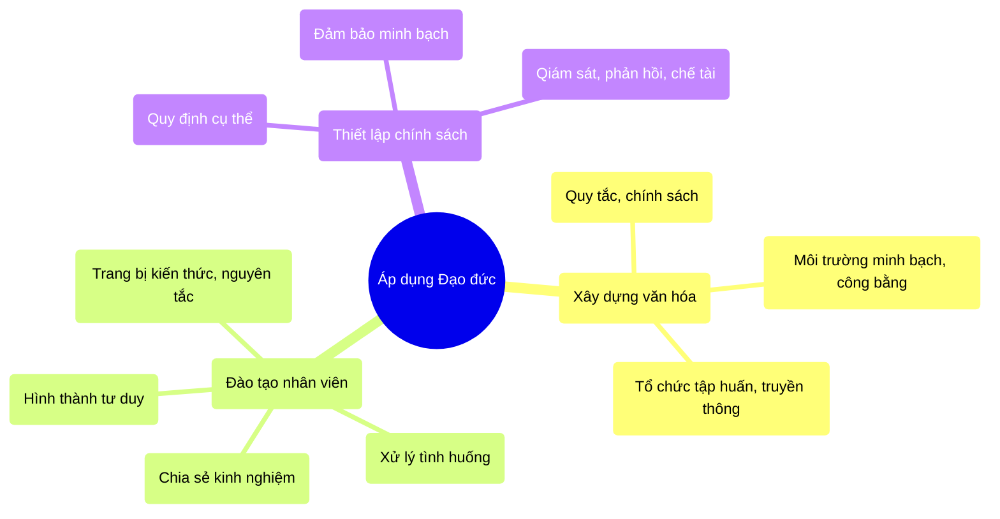
```mermaid
mindmap
  root((Áp dụng Đạo đức))
    (Xây dựng văn hóa)
      (Quy tắc, chính sách)
      (Môi trường minh bạch, công bằng)
      (Tổ chức tập huấn, truyền thông)
    (Đào tạo nhân viên)
      (Trang bị kiến thức, nguyên tắc)
      (Xử lý tình huống)
      (Chia sẻ kinh nghiệm)
      (Hình thành tư duy)
    (Thiết lập chính sách)
      (Quy định cụ thể)
      (Đảm bảo minh bạch)
      (Qiám sát, phản hồi, chế tài)
```

---

# Thực trạng về Đạo đức Kinh doanh ở Việt Nam

---

> [!comment|c-gray]
> ĐĐKD là một vấn đề mới ở Việt Nam, chỉ thực sự được quan tâm từ chính sách "Đổi mới và hội nhập quốc tế" năm 1991. Trước đó, dưới cơ chế kinh tế kế hoạch tập trung, các khái niệm này hầu như không được đề cập.
> Sau đó, các khái niệm xuất hiện, kéo theo nhận thức về ĐĐKD. Dù nhiều doanh nghiệp chú trọng xây dựng thương hiệu bền vững, vẫn có trường hợp chạy theo lợi nhuận, xem nhẹ đạo đức, gây hệ lụy kinh tế - xã hội.

## Đạo đức Kinh doanh ở Việt Nam

> [!columns blank|3]
> 
> > [!caption]
> > 
> > Chợ nông thôn thời bao cấp
> 
> > [!caption]
> > 
> > ASEAN
> 
> > [!caption]
> > 
> > Hội thảo đạo đức kinh doanh

---

> [!comment|c-gray]
> Một vấn đề đáng lo ngại là sự sai lệch trong ĐĐKD. Nhiều doanh nhân vì lợi nhuận mà bỏ qua đạo đức, gây tổn thất lớn cho ngân sách và ảnh hưởng đến nền kinh tế.
> Trong khi đó, kinh doanh có đạo đức không chỉ mang lại lợi ích cho doanh nghiệp mà còn tạo ra giá trị bền vững cho khách hàng và xã hội. Doanh nghiệp cần trung thực, giữ chữ tín, đảm bảo chất lượng sản phẩm và dịch vụ, thay vì chỉ chạy theo lợi ích cá nhân mà vi phạm đạo đức kinh doanh.

## Đạo đức Kinh doanh ở Việt Nam

> [!columns blank|3]
> 
> > [!caption]
> > 
> > Kiểm tra hàng giả
> 
> > [!caption]
> > 
> > Dấu diếm
> 
> > [!caption]
> > 
> > Ảnh hưởng tốt

---

> [!comment|c-gray]
> Đến 2024, ĐĐKD tại Việt Nam có nhiều chuyển biến tích cực, góp phần tạo môi trường lành mạnh, bền vững. Nhiều doanh nghiệp không chỉ chú trọng lợi nhuận, mà còn tuân thủ các quy tắc đạo đức:
> - Ý thức đạo đức nâng cao: Nhiều doanh nghiệp bắt đầu chú trọng trách nhiệm xã hội, tuân thủ quy chuẩn lao động, bảo vệ môi trường, nâng cao chất lượng, hỗ trợ cộng đồng, và đảm bảo quyền lợi người lao động. Ví dụ: Vinamilk, FPT, Viettel: xây dựng chính sách kinh doanh minh bạch, đầu tư vào cộng đồng và phát triển bền vững.
> - Hệ thống pháp luật chặt chẽ hơn: Chính phủ hoàn thiện hơn khung pháp lý kinh doanh, bảo vệ quyền lợi người dùng, chống hàng giả, hàng nhái, chống gian lận.
> - Sự giám từ truyền thông: Mạng xã hội giúp phát hiện, lên án hành vi kinh doanh thiếu đạo đức, tạo áp lực buộc phải tuân thủ chuẩn mực đạo đức.

## Mặt Tích cực Đạo đức Kinh doanh

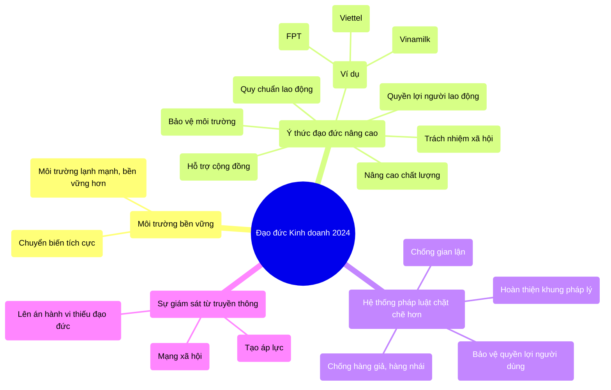
```mermaid
mindmap
    root((Đạo đức Kinh doanh 2024))
        (Môi trường bền vững)
            (Chuyển biến tích cực)
            (Môi trường lạnh mạnh, bền vững hơn)
        (Ý thức đạo đức nâng cao)
            (Trách nhiệm xã hội)
            (Quy chuẩn lao động)
            (Bảo vệ môi trường)
            (Nâng cao chất lượng)
            (Hỗ trợ cộng đồng)
            (Quyền lợi người lao động)
            (Ví dụ)
                (Vinamilk)
                (FPT)
                (Viettel)
        (Hệ thống pháp luật chặt chẽ hơn)
            (Hoàn thiện khung pháp lý)
            (Bảo vệ quyền lợi người dùng)
            (Chống hàng giả, hàng nhái)
            (Chống gian lận)
        (Sự giám sát từ truyền thông)
            (Mạng xã hội)
            (Lên án hành vi thiếu đạo đức)
            (Tạo áp lực)
```

---

> [!comment|c-gray]
> Thiếu lòng tin trong kinh doanh: Nhiều doanh nghiệp chỉ quan tâm lợi nhuận trước mắt, xem nhẹ chữ tín, không chú trọng xây dựng thương hiệu lâu dài. Dù có nhiều tiến bộ, nhưng vẫn còn nhiều vấn đề đáng lo ngại:
> - Hàng giả, hàng nhái, kém chất lượng phổ biến: 
> 	+ Sản xuất không đảm bảo tiêu chuẩn, sử dụng nguyên liệu độc hại (MDP3 trong nước tương, formaldehyde trong bún, Rhodamine B trong hạt dưa).
> 	+ Thực phẩm bẩn, sữa giả, mỹ phẩm không rõ nguồn gốc tràn lan, gây nguy hiểm sức khỏe.
> - Gian lận thuế, buôn lậu: Phổ biến ở biên giới, nhiều doanh nghiệp trốn thuế, kê khai gian dối (Coca-Cola, Kanaan bị phát hiện trốn thuế).
> - Môi trường lao động chưa đảm bảo: Trả lương thấp, không đóng bảo hiểm đầy đủ, vi phạm an toàn lao động, nhiều vụ đình công vì điều kiện làm việc kém.
> - Chạy theo lợi nhuận, bỏ qua trách nhiệm xã hội: Một số doanh nghiệp phá hoại môi trường để giảm chi phí (Formosa Hà Tĩnh xả thải năm 2016, gây thiệt hại lớn cho biển miền Trung).

## Những Vấn đề còn Tồn tại

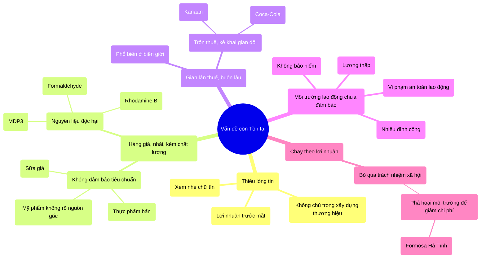
```mermaid
mindmap
  root((Vấn đề còn Tồn tại))
    (Thiếu lòng tin)
      (Lợi nhuận trước mắt)
      (Xem nhẹ chữ tín)
      (Không chú trọng xây dựng thương hiệu)
    (Hàng giả, nhái, kém chất lượng)
      (Không đảm bảo tiêu chuẩn)
	      (Thực phẩm bẩn)
	      (Sữa giả)
	      (Mỹ phẩm không rõ nguồn gốc)
      (Nguyên liệu độc hại)
	      (MDP3)
	      (Formaldehyde)
	      (Rhodamine B)
    (Gian lận thuế, buôn lậu)
      (Phổ biến ở biên giới)
      (Trốn thuế, kê khai gian dối)
	      (Coca-Cola)
	      (Kanaan)
    (Môi trường lao động chưa đảm bảo)
	      (Lương thấp)
	      (Không bảo hiểm)
	      (Vi phạm an toàn lao động)
	      (Nhiều đình công)
    (Chạy theo lợi nhuận)
	    (Bỏ qua trách nhiệm xã hội)
	      (Phá hoại môi trường để giảm chi phí)
		      (Formosa Hà Tĩnh)
```
---

# Giới thiệu về Doanh nghiệp Google

---

> [!comment|c-gray]
> Google là một công ty công nghệ hàng đầu, thành lập vào 1998 bởi Larry Page và Sergey Brin. Công ty bắt đầu với công cụ tìm kiếm, sau đó mở rộng sang nhiều lĩnh vực khác. Google được coi là một "Gã khổng lồ" trong lĩnh vực công nghệ. Google với tuyên bố sứ mệnh là "Tổ chức thông tin của thế giới" đã và đang trở nên ngày càng phát triển.

## Giới thiệu

> [!columns blank|3]
> 
> > [!caption]
> > 
> > Google
> 
> > [!caption]
> > 
> > Larry Page và Sergey Brin
> 
> > [!caption]
> > 
> > Big Tech

---

> [!comment|c-gray]
> Google hiện là một phần của tập đoàn Alphabet, được thành lập năm 2015. Đây là tập đoàn công nghệ đa quốc gia của Mỹ, hoạt động trong công nghệ thông tin và quảng cáo trực tuyến.
> Slogan ban đầu của Google, "Don't be evil" (Đừng trở nên xấu xa), nhấn mạnh việc kiếm tiền chính trực, không đánh đổi đạo đức. Đây là giá trị cốt lõi của Google từ khi thành lập.
> Đến tháng 10/2015, Alphabet thay đổi khẩu hiệu thành "Do the right thing" (Làm điều đúng đắn), yêu cầu nhân viên tuân thủ pháp luật, hành động trung thực và tôn trọng lẫn nhau.

## Giới thiệu

> [!columns blank|2]
> 
> > [!caption]
> > 
> > Alphabet
> 
> > [!caption]
> > 
> > "Don't be evil"

---

> [!comment|c-gray]
> Hiện nay Google đã phát triển rất nhiều dịch vụ và công cụ cho công đồng chung cũng như trong lĩnh vực kinh doanh. Những sản phẩm dịch vụ mang thương hiệu Google ở từng lĩnh vực như quảng cáo, tìm kiếm, học tập, công việc, phần cứng, phần mềm, giải trí, và nhiều nữa.

## Sản phẩm

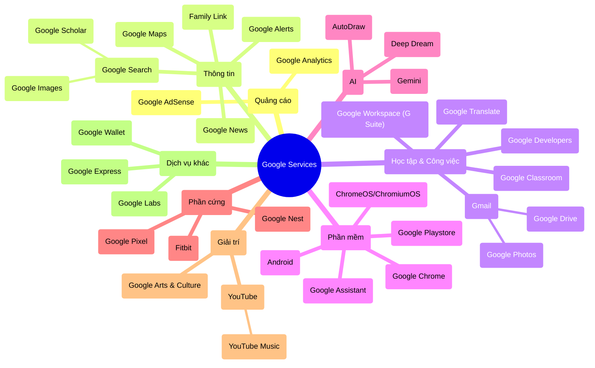
```mermaid
mindmap
	root((Google Services))
		(Quảng cáo)
			(Google Analytics)
			(Google AdSense)
		(Thông tin)
			(Google Search)
				(Google Images)
				(Google Scholar)
			(Google Maps)
			(Google News)
			(Google Alerts)
			(Family Link)
		(Học tập & Công việc)
			(Gmail)
				(Google Drive)
				(Google Photos)
			(Google Translate)
			(Google Classroom)
			("Google Workspace (G Suite)")
			(Google Developers)
		(Phần mềm)
			(Google Chrome)
			(Android)
			(Google Playstore)
			(Google Assistant)
			(ChromeOS/ChromiumOS)
		(AI)
			(Gemini)
			(AutoDraw)
			(Deep Dream)
		(Phần cứng)
			(Google Pixel)
			(Google Nest)
			(Fitbit)
		(Giải trí)
			(YouTube)
				(YouTube Music)
			(Google Arts & Culture)
		(Dịch vụ khác)
			(Google Wallet)
			(Google Express)
			(Google Labs)
```

---

> [!comment|c-gray]
> Tầm nhìn là hình ảnh lý tưởng trong tương lai, thể hiện mục tiêu lâu dài, định hướng chiến lược, hành động. Google hướng tới việc đưa thông tin đến mọi người nhanh chóng, thuận tiện:
> 
> *To provide access to the world’s information in one click.*
> *(Cung cấp quyền truy cập vào thông tin thế giới chỉ bằng một cú nhấp chuột.)*

## Tầm nhìn

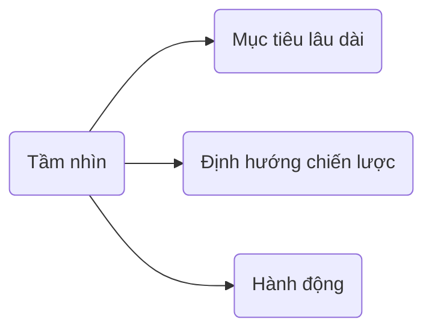
```mermaid
graph LR
  A(Tầm nhìn) --> B(Mục tiêu lâu dài)
  A --> C(Định hướng chiến lược)
  A --> D(Hành động)
```

> [!caption|p+r]
> 

> [!quote] Google
> To provide access to the world’s information in one click.
> 
> Cung cấp quyền truy cập vào thông tin thế giới chỉ bằng một cú nhấp chuột.

---

> [!comment|c-gray]
> Sứ mệnh của Google trong thời đại 4.0:
> - Cung cấp thông tin đáng tin cậy, hữu ích.
> - Giúp truy cập thông tin dễ dàng trên toàn cầu.
> - Tối ưu hóa tìm kiếm, mang lại kết quả nhanh và chính xác.
> - Cam kết bảo vệ quyền riêng tư người dùng.
> 
> *To organize the world’s information and make it universally accessible and useful.*
> *(Sắp xếp thông tin của thế giới và làm cho thông tin đó có thể truy cập và hữu ích trên toàn thế giới.*

## Sứ mệnh

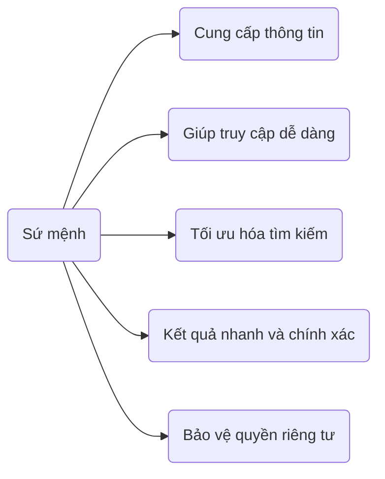
```mermaid
graph LR
  A(Sứ mệnh) --> B(Cung cấp thông tin)
  A --> C(Giúp truy cập dễ dàng)
  A --> D(Tối ưu hóa tìm kiếm)
  A --> E(Kết quả nhanh và chính xác)
  A --> F(Bảo vệ quyền riêng tư)
```

> [!caption|p+r]
> 

> [!quote] Google
> To organize the world’s information and make it universally accessible and useful.
> 
> Sắp xếp thông tin của thế giới và làm cho thông tin đó có thể truy cập và hữu ích trên toàn thế giới.

---

> [!comment|c-gray]
> Qua quá trình xây dựng và phát triển công ty, Google đã đúc kết được nhiều trải nghiệm. Họ tuyên bố giá trị cốt lõi mà công ty hướng đến được gọi chung là "Mười điều đúng đắn mà chúng tôi tin tưởng" (Ten things we know to be true), như trên slide:

## Giá trị cốt lõi

|                                                         |                                                     |
| ------------------------------------------------------- | --------------------------------------------------- |
| *Tập trung vào người dùng, và những thứ khác sẽ theo sau* | *Focus on the user and all else will follow*          |
| *Tốt nhất là làm một việc thật là tốt*                    | *It’s best to do one thing really, really well*       |
| *Nhanh tốt hơn chậm*                                      | *Fast is better than slow*                            |
| *Dân chủ trên mạng có hiệu quả*                           | *Democracy on the web works*                          |
| *Bạn không cần ngồi vào bàn để tìm ra giải pháp*          | *You don’t need to be at your desk to need an answer* |
| *Bạn có thể kiếm tiền mà không làm việc xấu*              | *You can make money without doing evil*               |
| *Luôn luôn có nhiều thông tin hơn ở ngoài kia*            | *There’s always more information out there*           |
| *Nhu cầu thông tin vượt mọi biên giới*                    | *The need for information crosses all borders*        |
| *Bạn có thể nghiêm túc mà không cần mặc vest*             | *You can be serious without a suit*                   |
| *Chỉ tốt thôi là chưa đủ*                                 | *Great just isn't good enough*                        |

---

> [!comment|c-gray]
> Google không chỉ là công ty công nghệ hàng đầu, mà còn là biểu tượng của đổi mới và bền vững trong kỷ nguyên số. Với sứ mệnh sắp xếp, tối ưu hóa thông tin và tầm nhìn giúp mọi người tiếp cận tri thức dễ dàng, Google định hình cách con người tìm kiếm và sử dụng thông tin. Tập trung vào người dùng, tốc độ, đổi mới, và đạo đức, Google không ngừng mở rộng ảnh hưởng, nâng cao trải nghiệm công nghệ và tạo ra giá trị cho xã hội.

## Giá trị cốt lõi

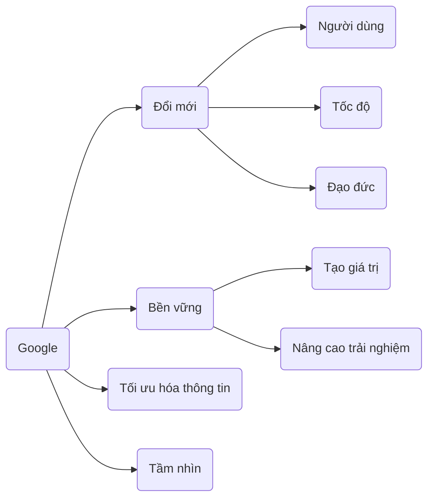
```mermaid
graph LR
    A(Google) --> B(Đổi mới)
    A --> C(Bền vững)
    A --> D(Tối ưu hóa thông tin)
    A --> E(Tầm nhìn)
    B --> F(Người dùng)
    B --> G(Tốc độ)
    B --> H(Đạo đức)
    C --> I(Tạo giá trị)
    C --> J(Nâng cao trải nghiệm)
```

---

> [!comment|c-gray]
> ĐĐKD là yếu tố quan trọng cho sự phát triển bền vững của doanh nghiệp, với Google là một ví dụ điển hình. Google đã xác định sứ mệnh rõ ràng từ đầu và luôn đặt người dùng lên hàng đầu. Công ty tuân thủ pháp luật và chuẩn mực đạo đức, chứng minh rằng sự phát triển không đi ngược lại với trách nhiệm xã hội.
> 
> Các slogan thể hiện rằng doanh nghiệp có thể thành công mà không đánh đổi đạo đức. Google dạy chúng ta rằng thành công bền vững gắn liền với trách nhiệm xã hội và việc tạo ra giá trị tích cực cho cộng đồng. Cuối cùng, Google là biểu tượng của sự đổi mới, luôn đề cao sáng tạo và sự khác biệt, khẳng định rằng đam mê và tôn trọng đạo đức là công thức chinh phục thế giới.

## Bài học

```mermaid
mindmap
  root((Bài học từ Google))
    (Đạo đức)
      (Sứ mệnh rõ ràng)
        (Đặt người dùng lên hàng đầu)
        (Tôn trọng luật pháp)
      (Trách nhiệm xã hội)
        (Đóng góp cho cộng đồng)
        (Bảo vệ môi trường)
    (Đổi mới)
      (Sáng tạo)
        (Công nghệ tiên tiến)
        (Sản phẩm mới)
      (Khác biệt)
        (Xây dựng thương hiệu)
        (Tạo ra giá trị độc đáo)
    (Khách hàng)
      (Đặt người dùng lên hàng đầu)
        (Trải nghiệm người dùng tốt)
        (Phản hồi và cải tiến)
      (Tạo giá trị tích cực cho cộng đồng)
        (Chương trình cộng đồng)
        (Hỗ trợ giáo dục và phát triển)
```

---
