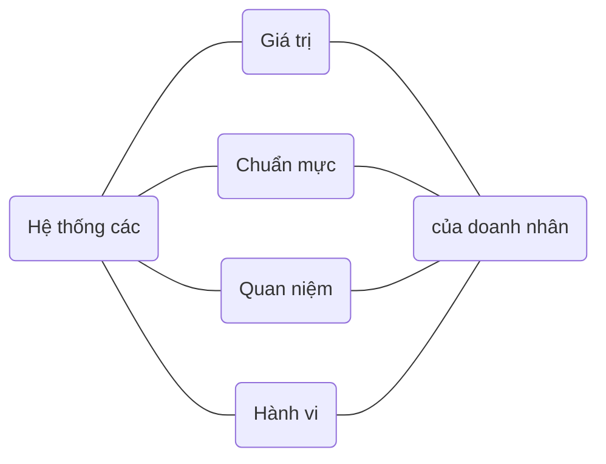
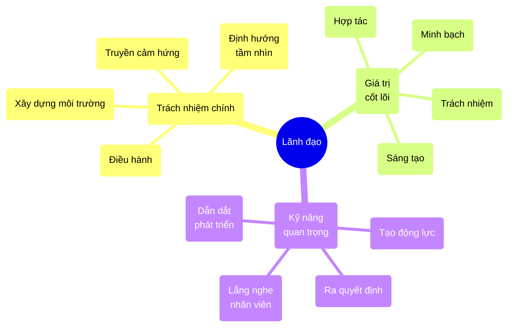
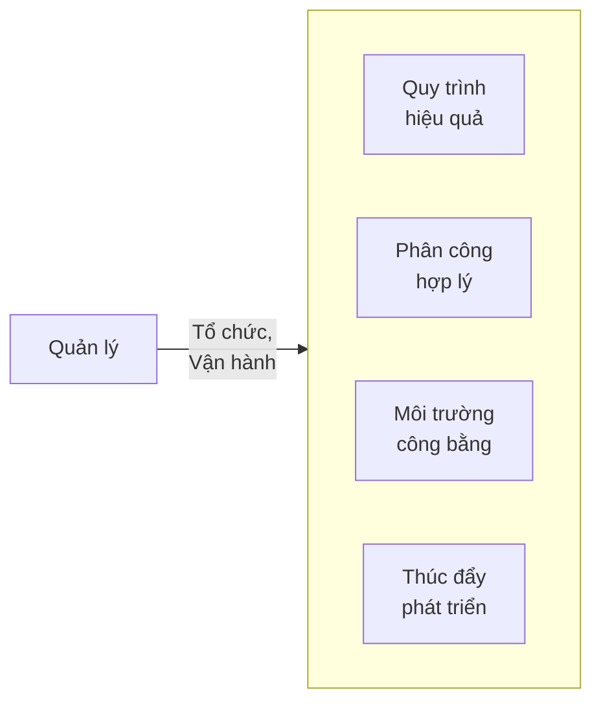
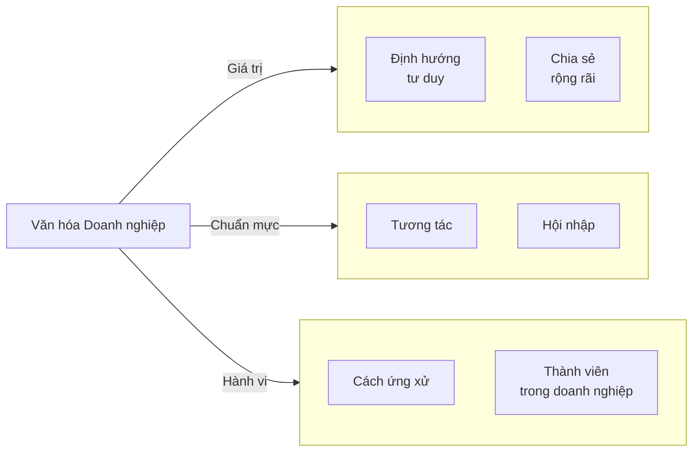
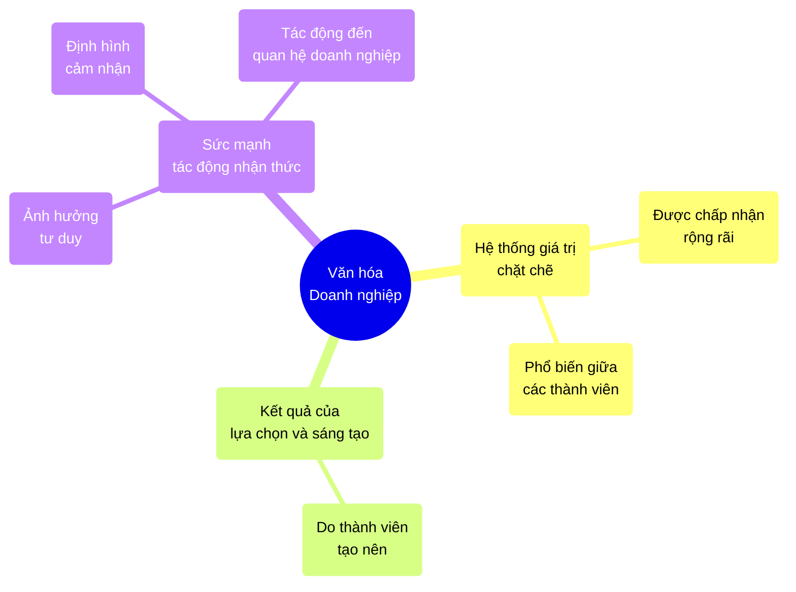
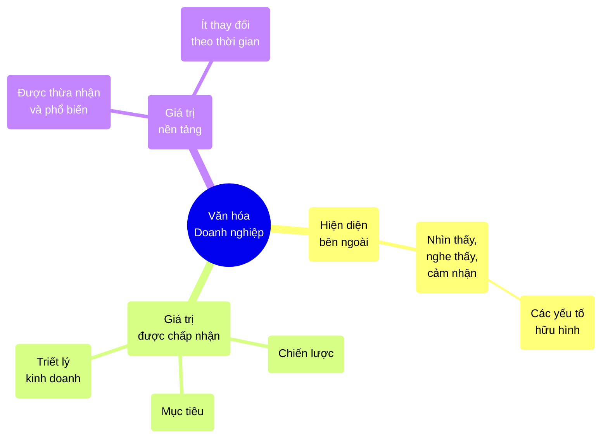
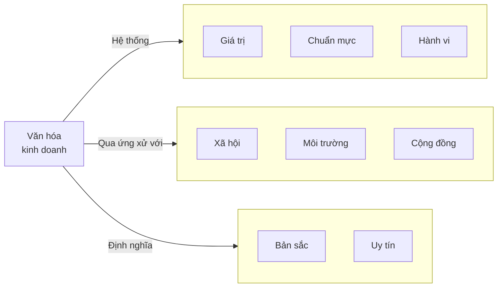
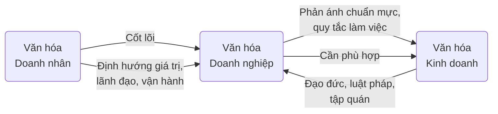

---
{"dg-publish":true,"permalink":"/Studies/University/Year 1/T2/EM1180 - Business Culture and Entrepreneurship/Project/Summary - slides/"}
---

> [!warning] Chú ý
> - Giữa mỗi 2 gạch dài là khoảng một slide
> - Phần "comment" là phần đọc, không cho vào slide
> - Ở thanh bên phải của trang web, có thể thấy rõ ràng chia phần hơn (mở trên máy tính)
> - Các tiêu đề to: mở đầu của phần
> - Các tiêu đề nhỏ: phía trên của slide

---

## Trình bày về Đạo đức Kinh doanh và Trách nhiệm Xã hội của Doanh nghiệp Google

*Môn học: Văn hoá kinh doanh và tinh thần khởi nghiệp - EM1180*

---
### Nhóm 5

> [!columns blank|3]
> 
> > [!blank]
> > <h6>Thành viên</h6>
> > Cù Thị Như Quỳnh
> > Phạm Mai Anh
> > Nguyễn Thị Khánh Vân
> > Nguyễn Phi Hoàng
> > Vũ Phúc Hưng
>
> > [!blank]
> > <h6>MSSV</h6>
> > 20230498 
> > 20230324 
> > 20230544 
> > 202416209
> > 202416512
> 
> > [!blank]
> > <h6>Nhiệm vụ</h6>

---

# Lời Mở đầu

---

> [!blank]
> 
> > [!caption|p+r] 
> > /warren-buffett-biography-586590455f9b586e02609252.jpg)
> 
> > [!quote] Warren Buffett
> > Đạo đức kinh doanh không phải là một sự lựa chọn, mà là nền tảng cho mọi quyết định.

---

> [!comment|c-gray]
> Qua nhiều thập kỷ, sự phát triển của xã hội và kinh tế, đặc biệt trong bối cảnh công nghệ và toàn cầu hóa, đã tạo ra nhiều dấu ấn quan trọng.
> Các doanh nghiệp tăng trưởng cùng với sự đóng góp mạnh mẽ vào nhiều lĩnh vực khác nhau trong đời sống xã hội, như
> - Tạo ra cơ hội việc làm cho người lao động
> - Nâng cao chất lượng cuộc sống
> - Đào tạo nguồn lực trẻ tiềm năng
> - Đóng góp cho ngân sách quốc gia thông qua thuế
> - Thúc đẩy thay đổi cơ cấu thị trường
> - ...

### Tác động của Doanh nghiệp trong Kỷ nguyên Toàn cầu hóa

> [!cards|2]
> 
> > [!caption]
> > 
> > Thúc đẩy tăng trưởng kinh tế, công nghệ
> 
> > [!caption]
> > 
> > Tạo việc làm, nâng chất lượng cuộc sống.
> 
> > [!caption]
> > 
> > Đào tạo nhân lực trẻ, đóng góp vào ngân sách.
> 
> > [!caption]
> > 
> > Thúc đẩy đổi mới, thay đổi cơ cấu thị trường.

---

> [!comment|c-gray] 
> Nhưng song song đó, sự cạnh tranh đã làm xuất hiện mặt tiêu cực bất chấp yếu tố đạo đức. Nhiều doanh nghiệp sai phạm trong sản xuất, bóc lột người lao động, đưa thông tin sai lệch nhằm đạt mục đích trục lợi đã gây ra những hậu quả nghiêm trọng cho cả doanh nghiệp lẫn cộng đồng.

### Mức Ảnh hưởng của Đạo đức Kinh doanh

**Cạnh tranh Khốc liệt Dẫn đến Hành vi Kinh doanh Phi đạo đức**
> [!cards|3] 
> > [!caption]
> > 
> > Bóc lột lao động
>
> > [!caption]
> > 
> > Sai phạm trong sản xuất
>
> > [!caption]
> > 
> > Thao túng thông tin

**⇒ Gây Tổn hại cho Doanh nghiệp & Cộng đồng**

---

> [!comment|c-gray]
> Vì vậy để phát triển bền vững, đạo đức kinh doanh là yếu tố quan trọng giúp doanh nghiệp được tin tưởng, tín nhiệm của người dùng và người lao động, đảm bảo uy tín và duy trì lợi thế cạnh tranh lâu dài. ĐĐKD là chìa khóa để doanh nghiệp tồn tại và phát triển thành công bền vững.

### Đạo đức Kinh doanh - Cách Phát triển Bền vững

**Đạo đức Kinh doanh giúp Doanh nghiệp:**

> [!cards|3] 
> > [!caption]
> > 
> > Xây dựng niềm tin & uy tín.
>
> > [!caption]
> > 
> > Duy trì lợi thế cạnh tranh dài hạn.
>
> > [!caption]
> > 
> > Phát triển bền vững & thành công.

---

> [!comment|c-gray]
> Sau quá trình học tập từ bài giảng, chúng em nhận thức được tầm quan trọng của ĐĐKD đối với doanh nghiệp. Nhóm em đã tìm hiểu, nghiên cứu về đề tài này, và thông qua đó đã có hiểu biết để nhìn nhận về những nguyên tắc và khía cạnh ĐĐKD mà doanh nghiệp Google đang áp dụng trong thực tiễn.
> 
> Trong quá trình làm có thể còn nhiều thiếu sót, nhóm chúng em rất mong sẽ nhận được những đánh giá từ cô để bài báo cáo được hoàn thiện hơn.
> 
> Chúng em xin chân thành cảm ơn!

> [!columns blank]
>
> > [!caption]
> > 
>
> > [!caption]
> > 

---

# Cơ sở Lý thuyết về Văn hóa Kinh doanh

---

> [!comment|c-gray]
> Văn hóa là tổng hòa những giá trị vật chất và tinh thần, cũng như các phương thức tạo ra chúng, kỹ năng sử dụng các giá trị đó vì sự tiến bộ của loài người, và sự truyền thụ các giá trị đó từ thế hệ này sang thế hệ khác.

## Văn hoá theo Triết học Mác - Lênin

**Văn hoá:**

> [!columns blank|3]
> 
> > [!caption]
> > 
> > Giá trị vật chất & tinh thần
> 
> > [!caption]
> > 
> > Phương thức sáng tạo & sử dụng vì sự tiến bộ
> 
> > [!caption]
> > 
> > Truyền từ thế hệ này sang thế hệ khác

---

> [!comment|c-gray]
> VD: Tín ngưỡng thờ cúng Hùng Vương là một nét văn hóa đặc sắc của Việt Nam, thể hiện lòng biết ơn tổ tiên và đoàn kết dân tộc. Hằng năm, người dân khắp cả nước hành hương về Đền Hùng để dâng hương tưởng nhớ các Vua Hùng.
> Không chỉ là nghi lễ tôn giáo, tín ngưỡng này còn phản ánh sâu sắc ý thức về nguồn cội, lòng tự hào dân tộc, và đạo lý "Uống nước nhớ nguồn". UNESCO đã công nhận đây là Di sản văn hóa phi vật thể đại diện của nhân loại, khẳng định giá trị và ý nghĩa sâu sắc của truyền thống này.

## Khái niệm Văn hoá theo Triết học Mác - Lênin

**Ví dụ:** Tín ngưỡng thờ cúng Hùng Vương

> [!columns blank|3]
> 
> > [!caption]
> > 
> > Tượng Vua Hùng
> 
> > [!caption]
> > 
> > Đền Hùng Phú Thọ
> 
> > [!caption]
> > 
> > Hành hương ở Đền Hùng

---

> [!comment|c-gray]
> Văn hóa doanh nhân là hệ thống các giá trị, chuẩn mực, quan niệm, và hành vi của doanh nhân trong quá trình lãnh đạo và quản lý doanh nghiệp.

## Văn hoá Doanh nhân

---
> [!comment|c-gray]
> Lãnh đạo không chỉ là điều hành, mà còn là khả năng truyền cảm hứng, định hướng, và xây dựng môi trường làm việc tích cực. Một doanh nhân có văn hóa lãnh đạo tốt sẽ đề cao tính minh bạch, trách nhiệm, sáng tạo và tinh thần hợp tác. Họ không chỉ ra quyết định, mà còn biết lắng nghe, tạo động lực cho nhân viên, và dẫn dắt tổ chức phát triển theo hướng bền vững.

## Văn hoá Doanh nhân trong Lãnh đạo

---

> [!comment|c-gray]
> Trong quản lý, VHDN thể hiện qua cách doanh nhân tổ chức, vận hành doanh nghiệp và giải quyết các vấn đề nội bộ. Một doanh nhân có văn hóa quản lý chuyên nghiệp sẽ chú trọng đến việc xây dựng quy trình làm việc hiệu quả, phân công công việc hợp lý, tạo môi trường làm việc công bằng và thúc đẩy sự phát triển cá nhân của nhân viên.

## Văn hoá Doanh nhân trong Quản lý

---

> [!comment|c-gray]
> VD: Phạm Nhật Vượng là một nhà lãnh đạo có tầm nhìn dài hạn và tinh thần tiên phong. Ông không ngừng đổi mới, thúc đẩy sự sáng tạo, và đưa thương hiệu Việt vươn tầm thế giới. Dưới sự dẫn dắt của ông, Vingroup đã mở rộng sang nhiều lĩnh vực, với VinFast trở thành biểu tượng của công nghiệp hóa. Ông đề cao trách nhiệm xã hội, tạo động lực cho nhân viên và hướng doanh nghiệp phát triển bền vững.

## Văn hoá Doanh nhân

**Ví dụ:**

> [!columns blank|3]
> 
> > [!caption]
> > 
> > Phạm Nhật Vượng
> 
> > [!caption]
> > 
> > Xe điện Vinfast VF7
> 
> > [!caption]
> > 
> > Vingroup trao học bổng

---

> [!comment|c-gray]
> VHDN hay Văn hoá tổ chức là hệ thống giá trị, chuẩn mực và hành vi được hình thành, tích lũy qua quá trình tương tác và hội nhập. Nó được chia sẻ rộng rãi, định hướng tư duy và cách ứng xử của các thành viên trong doanh nghiệp.

## Văn hoá Doanh nghiệp

---

> [!comment|c-gray]
> VD: VHDN của Google tập trung vào sự sáng tạo, linh hoạt, và môi trường làm việc thân thiện. Công ty khuyến khích nhân viên dành 20% thời gian cho các dự án cá nhân, tạo điều kiện cho ý tưởng mới như Gmail hay Google Maps ra đời. Google đề cao sự thẳng thắn, tinh thần khởi nghiệp, và làm việc nhóm, đồng thời cung cấp môi trường thoải mái với nhiều tiện ích. Những giá trị này giúp Google duy trì sự đổi mới và thu hút nhân tài toàn cầu.

## Văn hoá Doanh nghiệp

> [!columns blank|3]
> 
> > [!captions]
> > 
> > Nhân viên tại Google
> 
> > [!captions]
> > 
> > Nhân viên nghỉ ngơi
> 
> > [!captions]
> > 
> > "20% thời gian"

**=> Giúp Google duy trì sự đổi mới và thu hút nhân tài toàn cầu**

---

> [!comment|c-gray]
> - Các giá trị VHDN là hệ thống có quan hệ chặt chẽ, được chấp nhận, và phổ biến rộng rãi giữa các thành viên
> - Hệ thống các giá trị văn hoá phải là kết quả của quá trình lựa chọn hoặc sáng tạo của chính các thành viên
> - Các giá trị VHDN phải có một sức mạnh đủ để tác động đến nhận thức, tư duy và cảm nhận của các thành viên đối với các vấn đề và quan hệ của doanh nghiệp

## Văn hoá Doanh nghiệp

**Hiểu Thế nào cho Đúng về Văn hoá Doanh nghiệp**

---

> [!comment|c-gray]
> - Những gì một người từ bên ngoài DN có thể nhìn thấy, nghe thấy, hoặc cảm nhận được khi tiếp xúc với DN - các yếu tố hữu hình.
> - Những giá trị được chấp nhận, bao gồm những chiến lược, những mục tiêu và triết lý kinh doanh của DN.
> - Khi các giá trị được thừa nhận và phổ biến đến mức gần như không có sự thay đổi, chúng sẽ trở thành các giá trị nền tảng.

## Văn hoá Doanh nghiệp

**Cấu trúc của Hệ thống Văn hoá Kinh doanh**

---

> [!comment|c-gray]
> Văn hóa kinh doanh là hệ thống các giá trị, chuẩn mực, và hành vi do doanh nghiệp tạo ra trong quá trình hoạt động. Nó thể hiện qua cách ứng xử với xã hội, môi trường, và cộng đồng, góp phần định hình bản sắc và uy tín trong kinh doanh.

## Văn hoá Kinh doanh

---

> [!comment|c-gray]
> VD: Toyota dùng triết lý "Just-in-Time", tối ưu hóa sản xuất, giảm lãng phí, và nâng cao hiệu suất. Nhờ đó, hãng không chỉ tạo dựng niềm tin mà còn góp phần xây dựng môi trường kinh doanh bền vững và phát triển lâu dài.

## Văn hoá Kinh doanh

> [!columns blank|2]
> 
> > [!caption]
> > 
> > Toyota
> 
> > [!caption]
> > 
> > Bộ phận

---

> [!comment|c-gray]
> VHDNhân, DNghiệp, và KD có mối quan hệ chặt chẽ, tác động qua lại lẫn nhau. VHDNhân là cốt lõi, vì DNhân định hướng giá trị, phong cách lãnh đạo, và cách vận hành doanh nghiệp. Từ đó, VHDNghiệp hình thành, phản ánh các chuẩn mực ứng xử và quy tắc làm việc trong tổ chức.
> VHDNghiệp phải phù hợp với VHKD - bao gồm các quy chuẩn đạo đức, luật pháp, và tập quán chung của ngành nghề. Một DNghiệp có văn hóa tốt sẽ góp phần nâng cao môi trường kinh doanh, và sự suy thoái có thể gây hệ lụy tiêu cực. Vì vậy, để phát triển bền vững, DNghiệp cần hài hòa cả ba yếu tố này, với DNhân đóng vai trò then chốt.

## Mối Quan hệ giữa Văn hoá Doanh nhân, Văn hoá Doanh nghiệp, và Văn hoá Kinh doanh

---

> [!comment|c-gray]
> - Văn hoá là cơ sở cho phát triển doanh nghiệp
> - Tài sản quan trọng nhất là nhân lực
> - Yếu tố văn hóa là một công cụ quan trọng để phát huy tiềm năng của nguồn lực này
> - Mỗi doanh nghiệp cần xây dựng văn hoá riêng

## Kết luận

- Văn hoá: cơ sở
- Tài sản quan trọng nhất: nhân lực
- Yếu tố văn hóa: quan trọng để phát huy tiềm năn
- Doanh nghiệp: cần văn hoá riêng

---

