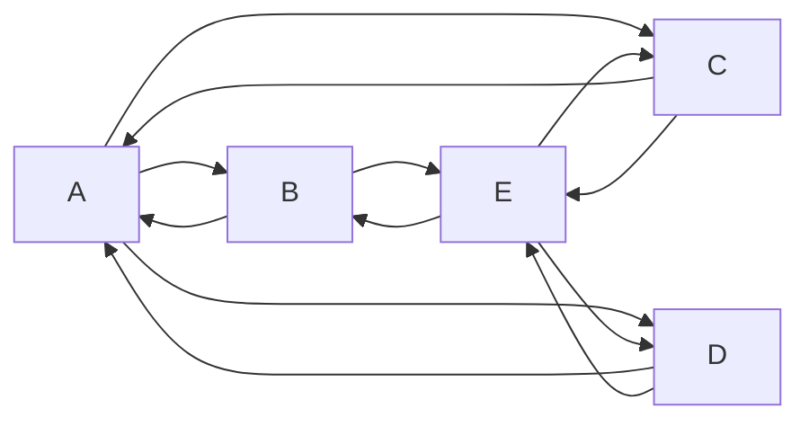
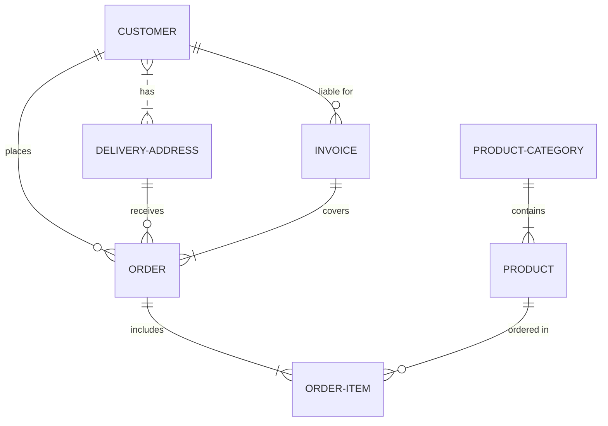

---
{"dg-publish":true,"permalink":"/Testing/Testing/md/"}
---

aa

aa
bb

<!-- aa -->

- ||
|-|
|a|

a
\
&emsp;a
\
&emsp;&emsp;a

| Just                               | a   | normal       | table |
| ---------------------------------- | --- | ------------ | ----- |
| Use `<` to merge cells to the left | <   | Merged cell! | <     |
| Use `^` to merge cells up          | <   | ^            | ^     |

| I        | -   | have | horizontal | headers |
| -------- | --- | ---- | ---------- | ------- |
| also     | -   | foo  | bar        | <       |
| have     | -   | 1    | 2          | 3       |
| vertical | -   | A    | B          | C       |
| headers! | -   | X    | Y          | Z       |

<testin>a</testin>

a <t:1689698880:f>

|  | < | < |
| ---- | ---- | ---- |
|  |  |  |
| ^ |  | < |
> [!quote] Fairy
> Imagine

